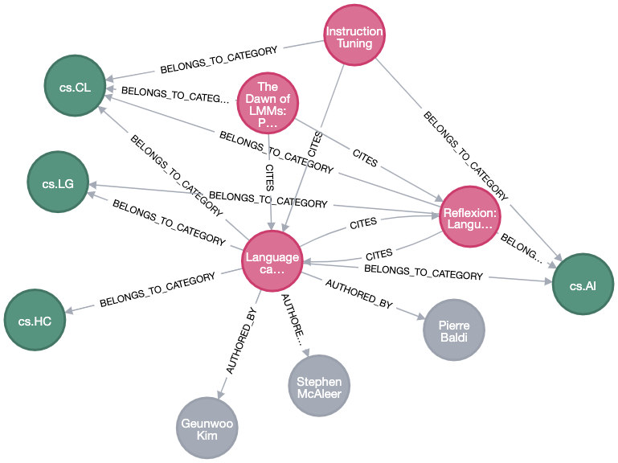

# Knowledge Graph backed RAG AMP

This repository demonstrates how to power a RAG(Retrieval Augmented Generation) application with a knowledge graph(supported by graph DBs like [Neo4j](https://neo4j.com/)) to capture relationships and contexts not easily accessible if vector databases are being used in a RAG pipeline

## AMP Overview

In this AMP, we create a corpus of significant AI/ML papers from [arXiv](https://arxiv.org/), and from first degree citations of these seed papers, resulting in a database of ~350 papers. We expect that these papers would atleast contain some informaton about the latest developments in Artificial Intelligence/Machine Learning/Large Language Models. The AMP user can ask AI/ML related questions, and the RAG pipeline would try to generate answers from the corpus stored in the database.

The AMP is powered by Knowledge Graph(backed by [Neo4j](https://neo4j.com/) Database in our case).

Integration of knowledge graph in this RAG pipeline aims to acheive two things:
 - Retrieve better quality text chunks by employing a hybrid retrieval strategy to pass on the LLM as context. In traditional retrieval methods, a vector embedding id calculated for an user input, and chunks are retrieved from a vector database(based on cosine similarity). We will employ a reranking methodology using information from knowledge graph to "rerank" the chunks retrieved using vector similarity, and pass the top **k** chunks as context.
 - Enhance the answer by giving auxillary information about the papers used to construct the answer, give recommendation about other related papers and top authors to the user.

The AMP is designed to run on and expects [Meta-Llama-3.1-8B-Instruct](https://huggingface.co/meta-llama/Meta-Llama-3.1-8B-Instruct) LLM as the backend. The AMP can leverage both remotely hosted LLM (Model URL, ID and API key needs to be passed) or locally(in-session) running LLM. In case of "local" LLM, the AMP is designed to run a 4-bit pre-quantized `Meta-Llama-3.1-8B-Instruct` model(It is pre-quantised as part of AMP steps, no manual intervention required).

## AMP Setup

### Configurable Options

**HF_TOKEN** : The AMP relies on [Huggingface Token](https://huggingface.co/docs/hub/en/security-tokens) to pull [meta-llama/Meta-Llama-3-8B-Instruct](https://huggingface.co/meta-llama/Meta-Llama-3-8B-Instruct) model from HuggingFace.

*Note*: Please make sure that the account associated with the HuggingFace token has access to the abovementioned model. It does require filling up a form to obtain access.

## AMP Concepts

Let's quickly go through some terminologies we would use throughout the AMP.

### Knowledge Graph

Knowledge graphs (KGs) organise data from multiple sources, capture information about entities of interest in a given domain or task (like people, places or events), and forge connections between them. In data science and AI, knowledge graphs are commonly used to:

 - Facilitate access to and integration of data sources.
 - Add context and depth to other, more data-driven AI techniques such as machine learning
 - Serve as bridges between humans and systems, such as generating human-readable explanations, or, on a bigger scale, enabling intelligent systems for scientists and engineers. 

An example KG from the AMP showing a paper, the categories the paper belongs to, its authors and other citing papers.

### Semantic Search

Semantic search is a search engine technology that interprets the meaning of words and phrases. The results of a semantic search will return content matching the meaning of a query, as opposed to content that literally matches words in the query.

**Vector Search** is a method for doing semantic search, used heavily in RAG pipelines. Vector search in a RAG context follows a series of steps:
 - We already have a corpus of text and their corresponding [vector embeddings](https://www.elastic.co/what-is/vector-embedding) stored in the database.
 - The vector embedding of the user query is calculated.
 - A vector similarity search is performed accross the database using a calculated embedding as the referance and top *k* results are retreived.

A simple diagram showing the flow of a vector search. Credits: [Elasticsearch B.V.](https://www.elastic.co/what-is/vector-embedding)

### Vector Databases

Vector databases store the vector embedding of a content(chunk of text, sound or image) along with some corresponding metedata for the content.

 - Vector databases offer well-known and easy-to-use features for data storage, like inserting, deleting, and updating data.
 - Vector databases have specialized capability to perform vector similarity search to retreive vector embeddings stored in the database along with the associated content based off some well known similarity metrics(Cosine similarity, or KNN).

*Note*: In our AMP, the Graph Database (Neo4j) also acts as vector database and have vector similarity search capabilities, thanks to [Graph Data Science(GDS)](https://github.com/neo4j/graph-data-science) plugin.

### Retrieval Augmented Generation (RAG)

### Re-Ranking

## AMP Flow

## AMP Requirements
